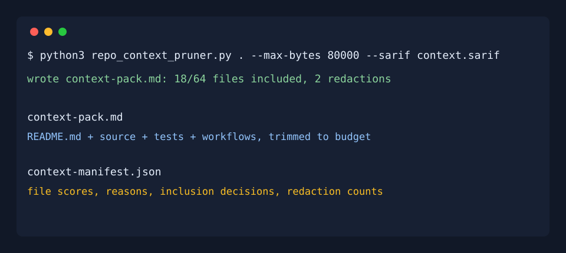

# Repo Context Pruner

Build a small, safe context pack before you hand a repository to an AI coding agent.

Repo Context Pruner is a zero-dependency Python CLI that scores source files, redacts secret-like values, and emits a size-bounded `context-pack.md` plus JSON/SARIF metadata. It is built for developers who want better context engineering without pasting an entire repo into an agent.

## Demo



## Quick Start

```bash
python3 repo_context_pruner.py . --max-bytes 80000 --sarif context.sarif
```

Outputs:

- `context-pack.md`: curated Markdown bundle for an AI agent
- `context-manifest.json`: file scores, inclusion decisions, redaction counts
- `context.sarif`: warning results for redacted secret-like values

## Why It Helps

AI coding agents work better when they get focused context instead of repo dumps. This tool prioritizes files that usually matter most:

- README and project metadata
- source code
- tests
- CI/workflow files
- compact files that fit in a context budget

It penalizes low-signal files and redacts token-like values before the pack is written.

## GitHub Actions

```yaml
name: Context Pack

on:
  pull_request:

jobs:
  context:
    runs-on: ubuntu-latest
    steps:
      - uses: actions/checkout@v4
      - name: Build agent context pack
        run: python3 repo_context_pruner.py . --max-bytes 80000 --sarif context.sarif
```

## JSON And SARIF

```bash
python3 repo_context_pruner.py . --manifest context-manifest.json --sarif context.sarif
```

The JSON manifest makes it easy to inspect why each file was included or skipped. SARIF lets security-aware teams surface redaction warnings in code scanning workflows.

## License

MIT
